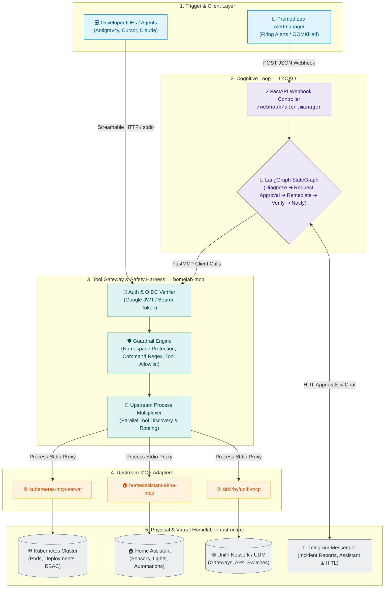
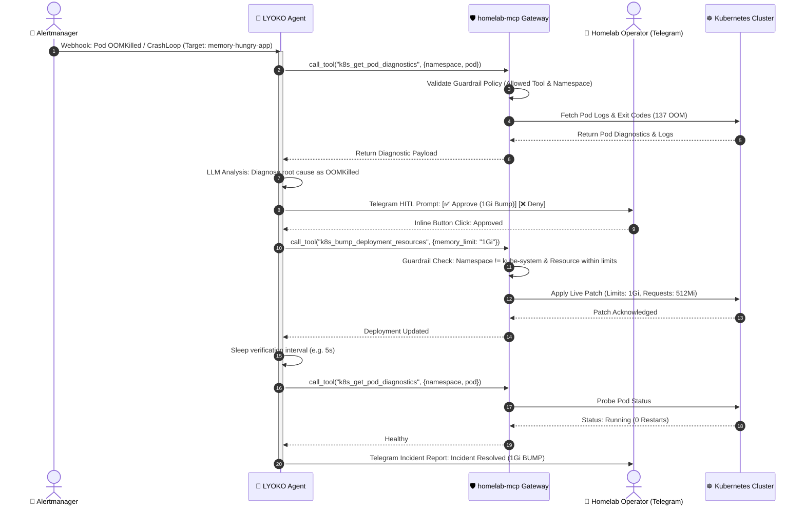

# homelab-aiops

[](https://www.python.org/downloads/)
[](https://github.com/astral-sh/uv)
[](https://github.com/astral-sh/ruff)
[](https://github.com/jlowin/fastmcp)
[](https://github.com/langchain-ai/langgraph)
[](https://opensource.org/licenses/MIT)

Autonomous **Homelab AIOps & Operations Platform** designed for Kubernetes homelabs and smart infrastructure, powered by **FastMCP** and **LangGraph**.

---

## 🏛️ System Architecture



---

## ⚡ Incident Remediation Lifecycle (with HITL Approval)



---

## 📦 Packages in this Monorepo

| Package | Path | Type | Description |
| :--- | :--- | :--- | :--- |
| **`homelab-mcp`** | [`packages/mcps/homelab-mcp`](packages/mcps/homelab-mcp) | **Gateway & Safety Harness** | Aggregated **FastMCP Gateway** proxying upstream tools (`ha-mcp`, `unifi-mcp`, `kubernetes-mcp-server`) with multi-tenant auth and safety guardrails. |
| **`lyoko`** | [`packages/agents/lyoko`](packages/agents/lyoko) | **Autonomous Agent** | Event-driven auto-remediation agent built with **LangGraph** StateGraph state machine and **FastAPI**. |

---

## ✨ Key Features

- **🛡️ Strict Safety Guardrails**: Built-in engine preventing destructive commands (`rm -rf`, `mkfs`, fork bombs), mutation in protected namespaces (`kube-system`), and unapproved tool invocations.
- **🔄 Event-Driven Self-Healing**: Automated diagnosis and remediation loops for common Kubernetes incident classes (`OOMKilled`, `CrashLoopBackOff`).
- **🔀 Unified FastMCP Gateway**: Single endpoint exposing Kubernetes, Home Assistant, and UniFi Network tools over Streamable HTTP (`/mcp`) and stdio.
- **🔐 Enterprise-Grade Authentication**: Google OIDC and token verification ensuring only authorized users and agents can execute infrastructure tools.
- **⚡ Modern Python Toolchain**: Built on Python 3.13+, managed deterministically via `uv` workspaces, and styled with `ruff`.

---

## 🚀 Quick Start

### 1. Prerequisites

- [Python 3.13+](https://www.python.org/downloads/)
- [`uv`](https://docs.astral.sh/uv/) (Ultra-fast Python package installer and resolver)
- `kubectl` configured with cluster context (or in-cluster ServiceAccount)

### 2. Installation & Setup

```bash
# Clone repository
git clone https://github.com/csp33/homelab-aiops.git
cd homelab-aiops

# Install workspace dependencies deterministically
uv sync

# Configure your environment variables
cp .env.example .env
```

### 3. Configure `.env`

Edit `.env` with your homelab details:

```ini
# LLM Provider
OPENAI_API_KEY=sk-your-openai-api-key-here
OPENAI_MODEL=gpt-4o-mini

# homelab-mcp Gateway Settings
MCP_HOST=0.0.0.0
MCP_PORT=8000
MCP_TRANSPORT=http

# Home Assistant (Optional)
HASS_URL=http://homeassistant.default.svc.cluster.local:8123
HASS_TOKEN=your-long-lived-access-token

# UniFi Network Controller (Optional)
UNIFI_HOST=https://192.168.1.1
UNIFI_USER=admin
UNIFI_PASSWORD=your-unifi-password

# LYOKO Agent Settings
LYOKO_HOST=0.0.0.0
LYOKO_PORT=9000
MCP_SERVER_URL=http://localhost:8000/mcp
```

### 4. Running the Services

```bash
# 1. Start homelab-mcp Tool Gateway (port 8000)
uv run --package homelab-mcp python -m homelab_mcp.server

# 2. Start LYOKO Remediation Agent (port 9000)
uv run --package lyoko python -m lyoko.main
```

### 5. Running Tests & Quality Checks

```bash
# Run pytest test suite
uv run pytest

# Check formatting and lint rules
uv run ruff check .
```

---

## 🔒 Security & Safety Harness

> [!IMPORTANT]
> This platform executes real operations on physical infrastructure and Kubernetes clusters. Safety guardrails are enforced at the gateway application layer before any upstream tool execution.

- **Protected Namespaces**: Critical system namespaces (e.g. `kube-system`) are strictly read-only by default. Destructive or mutating operations are blocked.
- **Dangerous Command Interception**: Execution payloads are parsed and matched against dangerous pattern signatures (e.g., recursive deletion, partition formatting).
- **Zero-Leak Policy**: All sensitive tokens and credentials must be injected through environment variables.

> [!NOTE]
> When operating against clusters managed by GitOps controllers (such as Argo CD or Flux), live mutations to Deployment specs can cause sync drift. For permanent configuration changes, configure your agent to generate Git pull requests.