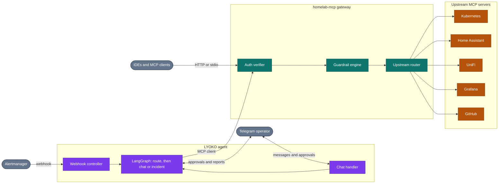
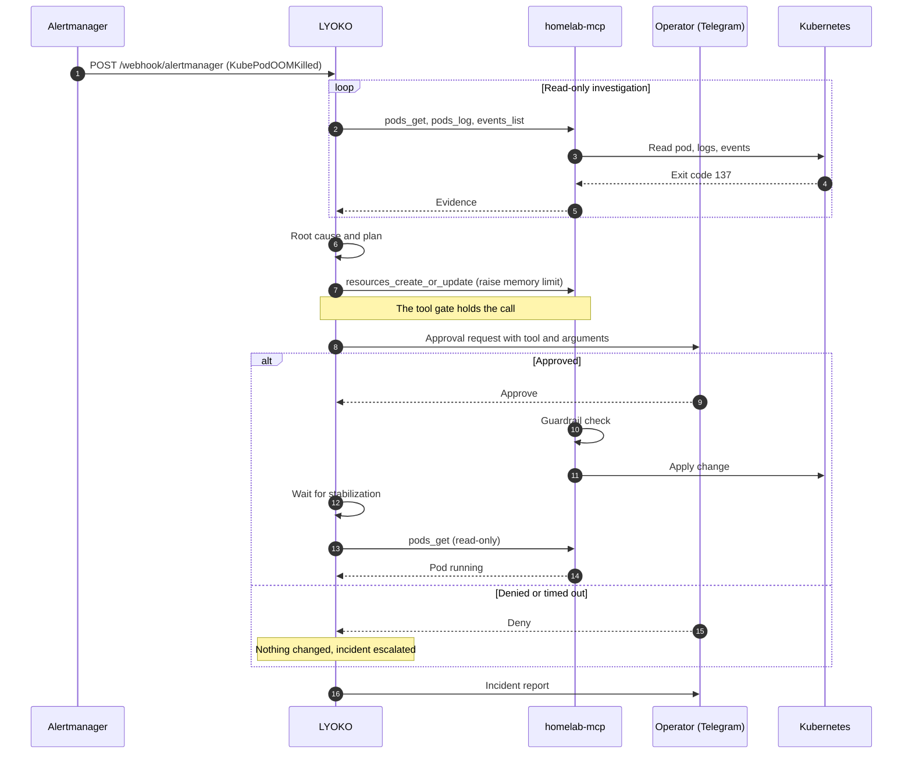

# homelab-aiops

[](https://www.python.org/downloads/)
[](https://github.com/astral-sh/uv)
[](https://github.com/astral-sh/ruff)
[](https://github.com/jlowin/fastmcp)
[](https://github.com/langchain-ai/langgraph)
[](https://opensource.org/licenses/MIT)

An AI operator for the whole homelab: Kubernetes, the network, the smart home, and observability. It receives incidents, works out the cause, and fixes them through a single authenticated, guardrail-protected tool gateway, with a human approving anything that is not explicitly trusted. Powered by **FastMCP** and **LangGraph**.

[Architecture](#architecture) · [Packages](#packages) · [Quick Start](#quick-start) · [Security](#security)

## Architecture

Two packages, one trust boundary. Every tool call, whether it comes from the LYOKO agent or from an IDE, goes through the `homelab-mcp` gateway, where authentication and guardrails are enforced before anything reaches an upstream system.



### Example: an OOMKilled pod

Every incident follows the same loop: investigate with read-only tools, decide on a fix, get approval for each change, apply it, verify, and report. The agent discovers tools at run time, so nothing in the loop is specific to Kubernetes. A UniFi access point that went offline or a Home Assistant integration that stopped responding takes the same path with different tools. The example below uses a pod that was killed for exceeding its memory limit.



Tool names come from the upstream servers, so they depend on your deployment. The agent finds them with `gateway_list_tools`.

## Packages

| Package | Role | Description |
| :--- | :--- | :--- |
| [`homelab-mcp`](packages/mcps/homelab-mcp) | Tool gateway | FastMCP gateway that aggregates upstream MCP servers behind authentication and safety guardrails. |
| [`lyoko`](packages/agents/lyoko) | Autonomous agent | Event-driven remediation agent built with LangGraph and FastAPI, with a Telegram chat assistant. |

## Features

- **Guardrails**: block destructive commands (`rm -rf`, `mkfs`, fork bombs), mutations in protected namespaces (`kube-system`), and tools outside the allowlist.
- **Autonomous remediation**: for any alert, an agent investigates with read-only tools, proposes a fix, and applies it. Every state-changing tool call needs human approval unless you put it on the auto-approve list, and the agent cannot change anything while diagnosing or verifying.
- **Whole-homelab assistant**: a Telegram assistant that can inspect and operate Kubernetes, Home Assistant, UniFi, and Grafana through the same gateway. It follows the same approval policy as alerts: reads run, trusted changes run, and any other change asks you first. A message that reports a broken service is handled like an alert, with investigation, fix, verification and report.
- **One gateway**: Kubernetes, Home Assistant, UniFi, Grafana, and GitHub tools behind a single endpoint over Streamable HTTP (`/mcp`) and stdio.
- **Authentication**: Google OIDC and bearer-token verification for users and agents.
- **Reproducible toolchain**: Python 3.13+, `uv` workspace, `ruff`.

## Quick Start

### 1. Prerequisites

- [Python 3.13+](https://www.python.org/downloads/)
- [`uv`](https://docs.astral.sh/uv/) (Ultra-fast Python package installer and resolver)
- `kubectl` configured with cluster context (or in-cluster ServiceAccount)

### 2. Installation & Setup

```bash
# Clone repository
git clone https://github.com/csp33/homelab-aiops.git
cd homelab-aiops

# Install workspace dependencies deterministically
uv sync

# Configure your environment variables
cp .env.example .env
```

### 3. Configure `.env`

Edit `.env` with your homelab details:

```ini
# LLM Provider
OPENAI_API_KEY=sk-your-openai-api-key-here
OPENAI_MODEL=gpt-4o-mini

# homelab-mcp Gateway Settings
MCP_HOST=0.0.0.0
MCP_PORT=8000
MCP_TRANSPORT=http

# Home Assistant (Optional)
HASS_URL=http://homeassistant.default.svc.cluster.local:8123
HASS_TOKEN=your-long-lived-access-token

# UniFi Network Controller (Optional)
UNIFI_HOST=https://192.168.1.1
UNIFI_USER=admin
UNIFI_PASSWORD=your-unifi-password

# LYOKO Agent Settings
LYOKO_HOST=0.0.0.0
LYOKO_PORT=9000
MCP_SERVER_URL=http://localhost:8000/mcp
```

### 4. Running the Services

```bash
# 1. Start homelab-mcp Tool Gateway (port 8000)
uv run --package homelab-mcp python -m homelab_mcp.server

# 2. Start LYOKO Remediation Agent (port 9000)
uv run --package lyoko python -m lyoko.main
```

### 5. Running Tests & Quality Checks

```bash
# Run pytest test suite
uv run pytest

# Check formatting and lint rules
uv run ruff check .
```

## Security

> [!IMPORTANT]
> This platform executes real operations on physical infrastructure and Kubernetes clusters. Safety guardrails are enforced at the gateway application layer before any upstream tool execution.

- **Protected Namespaces**: Critical system namespaces (e.g. `kube-system`) are strictly read-only by default. Destructive or mutating operations are blocked.
- **Dangerous Command Interception**: Execution payloads are parsed and matched against dangerous pattern signatures (e.g., recursive deletion, partition formatting).
- **Zero-Leak Policy**: All sensitive tokens and credentials must be injected through environment variables.

> [!NOTE]
> When operating against clusters managed by GitOps controllers (such as Argo CD or Flux), live mutations to Deployment specs can cause sync drift. For permanent configuration changes, configure your agent to generate Git pull requests.