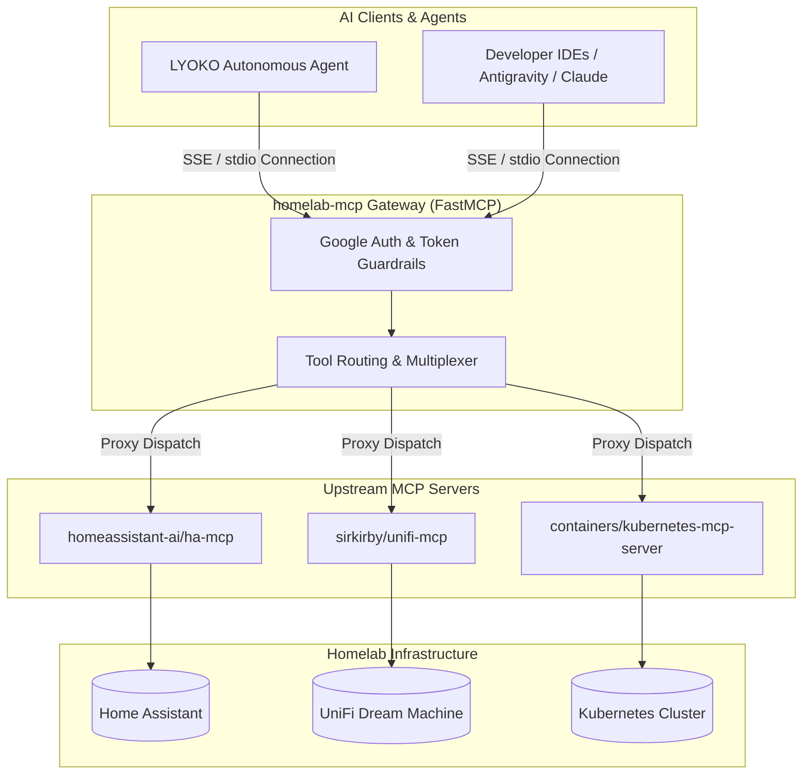

# homelab-aiops

[](https://www.python.org/downloads/)
[](https://github.com/astral-sh/uv)
[](https://github.com/astral-sh/ruff)
[](https://opensource.org/licenses/MIT)

Autonomous **Homelab AIOps** platform powered by **FastMCP** and **LangGraph**.

---

## 🏛️ Architecture Overview



---

## 📦 Packages in this Monorepo

| Package | Path | Description |
| :--- | :--- | :--- |
| **`homelab-mcp`** | [`packages/mcps/homelab-mcp`](packages/mcps/homelab-mcp) | Unified **FastMCP Gateway** proxying and aggregating upstream MCP servers (`ha-mcp`, `unifi-network-mcp`, `kubernetes-mcp-server`). |
| **`lyoko`** | [`packages/agents/lyoko`](packages/agents/lyoko) | **LYOKO** (*Live Yaml Optimization & K8s Orchestration*): Event-driven autonomous auto-remediation agent built with **LangGraph**. |

---

## 🚀 Quick Start

### 1. Prerequisites
- Python 3.13+
- [`uv`](https://docs.astral.sh/uv/) package manager
- `kubectl` configured with cluster access (or in-cluster ServiceAccount)

### 2. Installation & Environment Setup

```bash
# Clone repository
git clone https://github.com/csp33/homelab-aiops.git
cd homelab-aiops

# Install all workspace packages & dev dependencies
uv sync

# Configure environment variables
cp .env.example .env
# Edit .env with your credentials
```

### 3. Running Services Locally

```bash
# Start homelab-mcp Gateway (Streamable HTTP server on port 8000 at /mcp)
uv run --package homelab-mcp python -m homelab_mcp.server

# Start LYOKO Agent (FastAPI webhook receiver on port 9000)
uv run --package lyoko python -m lyoko.main
```

---

## 🔒 Security & Safety Harness

- **Principle of Least Privilege**: In-cluster deployments utilize tightly scoped Kubernetes RBAC permissions.
- **Guardrails**: Critical namespaces (such as `kube-system`) and destructive operations require explicit safety overrides or Human-in-the-Loop (HITL) approval.
- **Zero-Leak Policy**: All credentials are systematically loaded through environment variables and strictly ignored by Git.

---

## 📄 License

This project is licensed under the MIT License - see the [LICENSE](LICENSE) file for details.