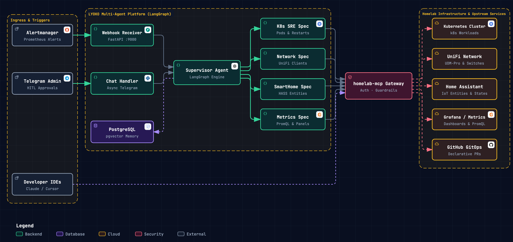
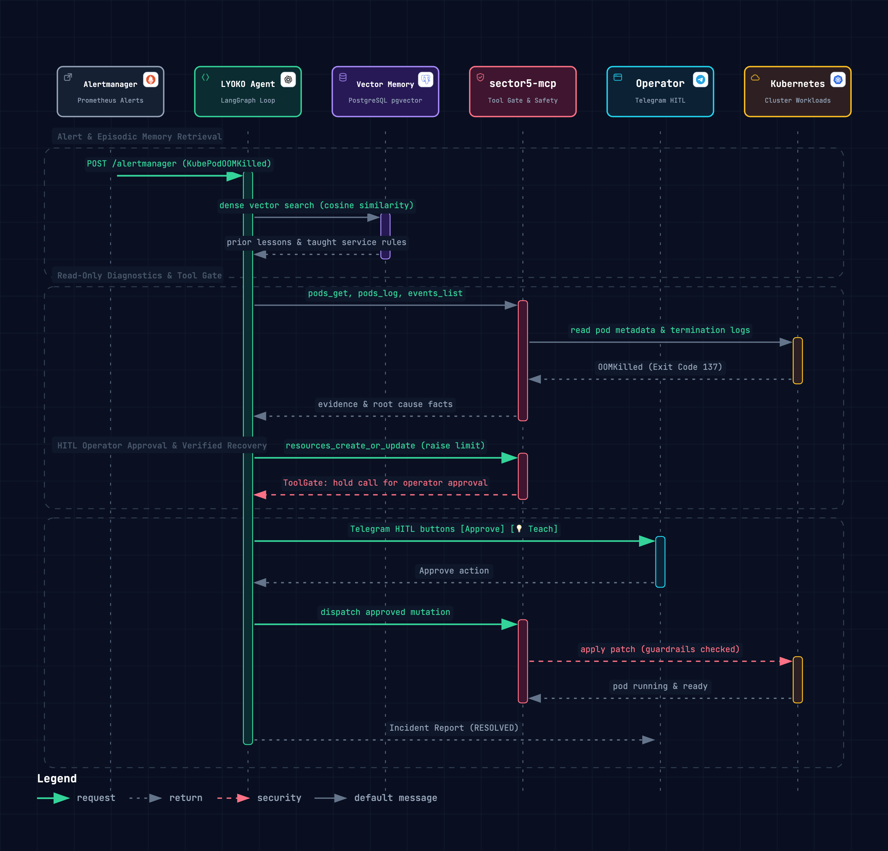

# System Architecture & Incident Lifecycle

This document describes the end-to-end architecture, multi-agent orchestration, memory retrieval model, and incident remediation lifecycle of `homelab-aiops`.

---

## High-Level System Architecture

`homelab-aiops` decouples intelligence from execution through two primary subsystems:

1. **`LYOKO` (Autonomous Remediation Engine)**: Built on **LangGraph** and **FastAPI**, handling alert webhooks from Prometheus Alertmanager and operator chat sessions via Telegram.
2. **`homelab-mcp` (Tool Gateway & Safety Harness)**: Built on **FastMCP**, aggregating upstream domain APIs (Kubernetes, UniFi, Home Assistant, Grafana, GitHub) behind strict guardrails and authentication.

  
   
  <em>Click diagram to launch interactive viewer with tracing, filters, and theme switching.</em>

---

## Multi-Agent Hierarchical Orchestration

LYOKO organizes intelligence into a hierarchical delegation pattern:

- **Supervisor & Planner**: Coordinates cross-domain analysis and synthesizes root-cause hypotheses without needing direct knowledge of every individual API schema.
- **Domain Specialists**: Domain-focused subagents equipped with tailored upstream toolsets via `homelab-mcp`:
  - **Kubernetes SRE**: Inspects pods, deployment manifests, events, logs, and Argo CD CRD applications.
  - **Network Specialist**: Manages UniFi controller client tables, port assignments, APs, and VLANs.
  - **Smart Home Specialist**: Interacts with Home Assistant entities, services, and automations.
  - **Observability Specialist**: Queries Prometheus metrics and correlates Grafana alert states.

---

## End-to-End Remediation Lifecycle

Every incident progresses through an autonomous 4-stage StateGraph:

1. **`diagnose`**: Supervisor delegates to domain specialists to run **strictly read-only** investigation tools. Concurrently, relevant operator feedback and incident memory are retrieved from PostgreSQL via vector similarity.
2. **`remediate`**: Supervisor forms an actionable plan and delegates execution to specialists. Any state-changing tool call is held by the `ToolGate` awaiting Human-in-the-Loop (HITL) approval via Telegram unless listed in `AUTO_APPROVED_TOOLS`.
3. **`verify`**: After a stabilization delay, specialists perform read-only health checks to confirm recovery.
4. **`notify`**: Formats a structured incident report reflecting the tools actually executed and posts it to the operator.

### Incident Remediation & Episodic Memory Sequence

  
   
  <em>Click diagram to launch interactive sequence timeline viewer.</em>

---

## Semantic Episodic Memory (`pgvector`)

To avoid repeating mistakes and allow continuous operator steering, LYOKO persists interactions in PostgreSQL with the `pgvector` extension:

- **Embeddings**: Generated using OpenAI `text-embedding-3-small` (1536 dimensions).
- **Index**: HNSW (Hierarchical Navigable Small World) with Cosine Distance (`vector_cosine_ops`) for sub-millisecond retrieval.
- **Dynamic Context Interpolation**: Before diagnosis, top matching operator feedback entries are injected directly into the Supervisor prompt.

---

## Related Documentation

- [Security & Guardrails](file:///Users/spcarlos33/.gemini/antigravity/worktrees/homelab-aiops/split_root_readme/docs/security-guardrails.md)
- [homelab-mcp Package Guide](file:///Users/spcarlos33/.gemini/antigravity/worktrees/homelab-aiops/split_root_readme/packages/mcps/homelab-mcp/README.md)
- [LYOKO Agent Package Guide](file:///Users/spcarlos33/.gemini/antigravity/worktrees/homelab-aiops/split_root_readme/packages/agents/lyoko/README.md)
