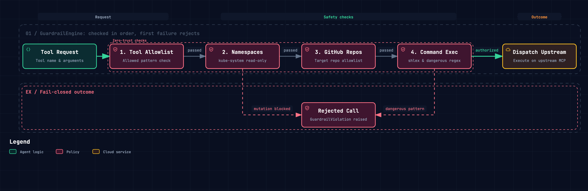

# Security & Safety Guardrails

`homelab-aiops` is designed to run against real physical infrastructure, Kubernetes clusters, network switches, and IoT controllers. Safety is enforced through a defense-in-depth model combining gateway-level guardrails, multi-tenant authentication, and human-in-the-loop (HITL) approval gating.

---

## Defense in Depth Architecture

  

---

## 1. Gateway Guardrail Engine (`homelab-mcp`)

Every tool call dispatched to `homelab-mcp` passes through the `GuardrailEngine` before hitting upstream providers.

### Protected Namespaces
- Critical system namespaces (e.g., `kube-system`, `cert-manager`, `ingress-nginx`) are protected by default.
- Only inspection tools (matching patterns `*_get`, `*_list`, `*_log`, `*_top`) are permitted against protected namespaces.
- Any mutating action (`create`, `patch`, `delete`, `scale`, `exec`) targeting a protected namespace is immediately aborted.
- Target namespaces are extracted from arguments (`namespace`), manifest metadata (`metadata.namespace`), and target resource names.

### Command Execution Sanitization
When invoking container or host execution tools:
- Shell commands are parsed and tokenized via `shlex`.
- Payloads are matched against signatures of dangerous operations, including:
  - Recursive root or wildcard deletions (`rm -rf /`, `rm -rf /*`)
  - Raw disk formatting and block writing (`mkfs`, `dd if=...`)
  - Fork bombs (`:(){ :|:& };:`)
  - Direct kernel parameter tampering

### GitHub Repository Policies
- Upstream GitHub MCP calls are evaluated against glob allowlists (`GITHUB_ALLOWED_REPOS`) and denylists (`GITHUB_BLOCKED_REPOS`).
- Prevents accidental mutations to external or unmanaged repositories.

---

## 2. Human-in-the-Loop (HITL) ToolGate (`LYOKO`)

Autonomous actions are governed by the agent's `ToolGate`:

1. **Read-Only Tools (`READ_ONLY_TOOLS`)**:
   - Safe inspection operations (e.g., `k8s_pods_get`, `ha_get_state`, `unifi_get_top_clients`).
   - Run freely during all phases (diagnosis, remediation, verification, chat).
2. **Auto-Approved Tools (`AUTO_APPROVED_TOOLS`)**:
   - Explicitly trusted non-destructive mutations (e.g., restarting a specific preview deployment).
   - Empty by default.
3. **Approval-Gated Tools**:
   - Any state-changing mutation prompts the operator via interactive Telegram inline buttons (`[Approve]` / `[Deny]` / `[💡 Teach Rule]`).
   - Execution pauses with a configurable timeout (default 5 minutes). Timed-out requests count as denied.
   - During `diagnose` and `verify` phases, state mutations are strictly prohibited and immediately refused.

---

## 3. Multi-Tenant Authentication & Identity

- **Google OIDC Proxy**: Supports OAuth 2.0 / OIDC authentication with email domain and identity allowlisting.
- **Service Tokens**: Inter-service communication between `LYOKO` and `homelab-mcp` utilizes bearer tokens (`SERVICE_TOKEN`).
- **Telegram RBAC**: Chat messages and approval callbacks are verified against `TELEGRAM_ALLOWED_USER_IDS` and `TELEGRAM_ALLOWED_CHAT_IDS`.

---

## 4. GitOps Drift Notice

> [!WARNING]
> When operating in clusters managed by GitOps controllers (such as **Argo CD** or **Flux**):
> - Direct live mutations to Deployment manifests via `kubectl patch` or MCP resource updates can trigger immediate reconciliation drift or rollbacks.
> - **Best Practice**: Use non-conflicting mutation techniques (e.g., mutating annotations, temporary scaling) for urgent incident triage, and submit pull requests via the GitHub MCP provider for permanent configuration changes.

---

## 5. Zero-Leak Policy (Public Repository)

This repository is strictly open source and public:
- **No Secrets in Code**: API keys, bearer tokens, Telegram tokens, and private hostnames are strictly injected via `.env` and environment variables.
- **Mocked Testing**: Test suites run against local mocks, fixtures, or isolated test containers without real credentials.

---

## Related Documentation

- [System Architecture](file:///Users/spcarlos33/.gemini/antigravity/worktrees/homelab-aiops/split_root_readme/docs/architecture.md)
- [homelab-mcp Package Guide](file:///Users/spcarlos33/.gemini/antigravity/worktrees/homelab-aiops/split_root_readme/packages/mcps/homelab-mcp/README.md)
- [LYOKO Agent Package Guide](file:///Users/spcarlos33/.gemini/antigravity/worktrees/homelab-aiops/split_root_readme/packages/agents/lyoko/README.md)
