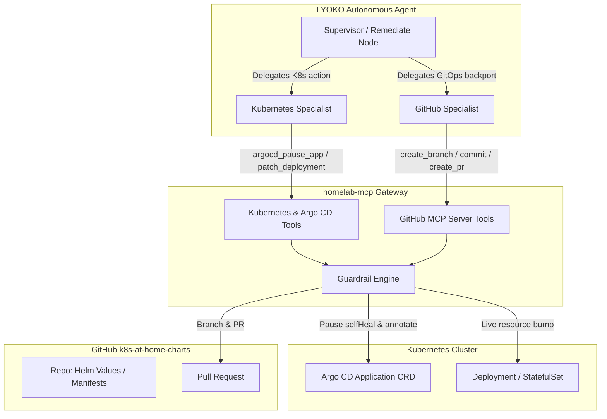
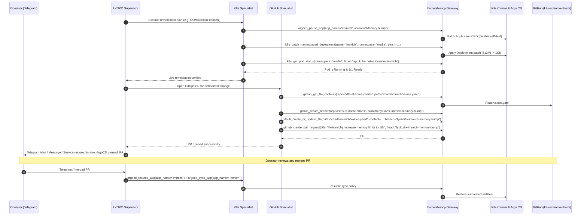

# Argo CD GitOps Bypass & Hotfix Patching Design

## 1. Problem Statement & Motivation

When an autonomous operations agent (`LYOKO`) detects an incident in a Kubernetes cluster (such as an `OOMKilled` crashloop or probe misconfiguration), applying a live Kubernetes patch (`kubectl patch`) restores service immediately. However, in a GitOps environment where **Argo CD** manages workloads with `automated: { prune: true, selfHeal: true }`, Argo CD detects the live modification as state drift and automatically reverts the patch within seconds, re-introducing the crash or outage.

Conversely, relying exclusively on Git PR creation before mitigating the incident significantly increases Mean Time to Recovery (MTTR) while waiting for CI checks, approvals, and sync cycles.

This design introduces a **two-phase hybrid remediation strategy**:
1. **Live Emergency Hotfix with Temporary Argo CD Auto-Sync/Self-Heal Bypass**: LYOKO disables `selfHeal` on the specific Argo CD `Application` CRD and applies the live patch immediately.
2. **Asynchronous GitOps Backport via GitHub MCP**: LYOKO's GitHub specialist generates a branch, commits the declarative changes (e.g., Helm `values.yaml`), and opens a Pull Request against the GitOps repository (`k8s-at-home-charts`), notifying the operator via Telegram.

---

## 2. Architecture & Components

### Component Responsibilities

1. **`homelab-mcp` (Tool Gateway & Safety Guardrails)**:
   - Exposes typed tools for Argo CD `Application` lifecycle management (`argocd_pause_app`, `argocd_resume_app`, `argocd_sync_app`, `argocd_get_app_status`).
   - Integrates the existing GitHub MCP upstream (`@modelcontextprotocol/server-github`) for file inspection, branch creation, commit creation, and Pull Request opening.
   - Enforces guardrails: namespace allowlists/denylists, resource bump ceilings (max $+100\%$ or max 4GiB memory per pod), blocked destructive operations (`delete pvc`, `privileged: true`, cluster-admin RBAC).

2. **`LYOKO` (Autonomous Remediation Engine)**:
   - **Remediate Phase**:
     - Coordinates `ask_kubernetes_specialist` to pause the relevant Argo CD `Application` and apply the verified live patch.
     - Coordinates `ask_github_specialist` to locate the source manifest/values in `k8s-at-home-charts`, commit the fix to a new branch, and open a Pull Request.
   - **Verify Phase**:
     - Confirms the patched workload reaches `Running` / `Ready` state without immediate crashloops.
   - **Notify Phase**:
     - Sends a comprehensive Telegram notification with the live remediation summary, link to the opened PR, and the status of Argo CD.

---

## 3. Tool Specifications & Contracts

### 3.1 Argo CD Lifecycle Tools (`homelab-mcp`)

Registered under the `kubernetes` domain (with category aliases `argocd`, `gitops`, `argo`):

- **`argocd_pause_app(app_name: str, reason: str, incident_id: str | None = None) -> ToolResult`**:
  - Targets `argoproj.io/v1alpha1` `Application` in the `argocd` namespace.
  - Reads existing `spec.syncPolicy`.
  - Saves the original `syncPolicy` as a JSON string in annotation `lyoko.homelab/original-sync-policy`.
  - Annotates with `lyoko.homelab/maintenance: "active"` and `lyoko.homelab/paused-reason: "<reason>"`.
  - Patches `spec.syncPolicy.automated: null` (or `spec.syncPolicy.automated.selfHeal: false`).
  
- **`argocd_resume_app(app_name: str) -> ToolResult`**:
  - Restores `spec.syncPolicy` from `lyoko.homelab/original-sync-policy` annotation.
  - Removes `lyoko.homelab/maintenance` and `lyoko.homelab/paused-reason` annotations.

- **`argocd_sync_app(app_name: str, prune: bool = False) -> ToolResult`**:
  - Triggers an immediate refresh/sync operation on the Argo CD application.

- **`argocd_get_app(app_name: str) -> ToolResult`**:
  - Retrieves sync status, health status, source repo, path, target revision, and active maintenance annotations.

### 3.2 GitHub Tools (`homelab-mcp` GitHub Upstream)

Exposed via `@modelcontextprotocol/server-github` and scoped to the `github` domain (`gh`, `git`, `repo`):

- **`github_get_file_contents(owner: str, repo: str, path: str, branch: str | None = None)`**
- **`github_create_branch(owner: str, repo: str, branch: str, from_branch: str = "main")`**
- **`github_create_or_update_file(owner: str, repo: str, path: str, content: str, message: str, branch: str)`**
- **`github_create_pull_request(owner: str, repo: str, title: str, head: str, base: str = "main", body: str = "")`**

---

## 4. Remediation Workflow Sequence

---

## 5. Security Guardrails & Operational Constraints

1. **Permitted Live Mutation Scope**:
   - **Resource Limits & Requests**: CPU and Memory adjustment up to $+100\%$ of current value, not exceeding global pod ceiling ($4\text{ GiB}$ RAM / $2\text{ CPUs}$).
   - **Deployment Strategy**: Modifying `strategy.type: RollingUpdate` to `Recreate` for single-replica RWO PersistentVolume workloads.
   - **Probes**: Adjusting `initialDelaySeconds` and `timeoutSeconds`.
   - **Scaling**: Adjusting `replicas` for temporary restart cycles ($0 \to 1$).
   - **Image Tag Rollback**: Reverting image tag to previous stable tag if crash on boot is detected.

2. **Strictly Prohibited Live Mutations (Hard Denylist)**:
   - Deleting PersistentVolumeClaims (`pvc`) or PersistentVolumes (`pv`).
   - Modifying `securityContext` (`privileged: true`, `hostPath`, `allowPrivilegeEscalation: true`).
   - Mutating RBAC (`Role`, `RoleBinding`, `ClusterRole`, `ClusterRoleBinding`).
   - Modifying core protected namespaces (`kube-system`, `kube-node-lease`, `cert-manager`, `cilium`).
   - Modifying Argo CD infrastructure itself (only `Application` CRDs for tenant workloads are editable).

3. **Stale Maintenance Fail-Safe**:
   - Applications paused by LYOKO carry `lyoko.homelab/paused-at` timestamp.
   - If an application remains paused for longer than 24 hours without Git merge or resumption, LYOKO sends a reminder notification to Telegram.

---

## 6. Testing & Verification Strategy

1. **Unit Tests**:
   - `homelab-mcp`: Test `argocd_pause_app`, `argocd_resume_app`, `argocd_sync_app` serialization and error handling against mocked Kubernetes Dynamic/CustomResource API.
   - Guardrails: Ensure `argocd_*` tools properly check and enforce allowed target applications and namespaces.
2. **Specialist & Supervisor Integration Tests**:
   - `LYOKO`: Mock `ask_kubernetes_specialist` and `ask_github_specialist` in `remediate` and `verify` workflow nodes.
   - Verify proper propagation of incident IDs, PR links, and Telegram notification payloads.
3. **Clean Architecture Enforcement**:
   - Ensure all new domain models, ports, application services, and infrastructure adapters pass `tests/test_clean_architecture.py`.
