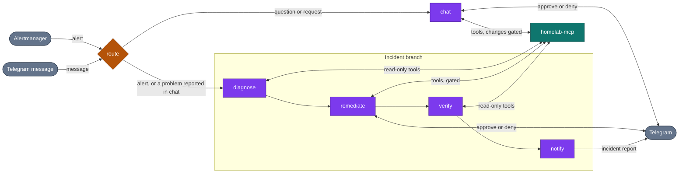

# LYOKO

[](https://github.com/langchain-ai/langgraph)
[](https://fastapi.tiangolo.com)
[](https://www.python.org/downloads/)
[](https://langfuse.com)
[](https://opensource.org/licenses/MIT)

**LYOKO** (**L**ive **Y**aml **O**ptimization & **K**8s **O**rchestration) is an event-driven AI operator for the homelab, built with **LangGraph**, **FastAPI**, and **python-telegram-bot**. It acts through the `homelab-mcp` gateway, so it can work on anything the gateway exposes: Kubernetes, UniFi, Home Assistant, Grafana, and GitHub.

It serves two roles:
1. **Autonomous incident remediation**: receives an alert (Prometheus Alertmanager webhook), diagnoses the root cause, proposes a fix, asks a human for approval unless the action is trusted, applies it, and verifies recovery.
2. **Interactive chat assistant**: a Telegram interface to the same tools, to answer questions about the infrastructure and operate it, for example scale a workload, inspect a UniFi device, or change a Home Assistant entity.

Both roles are one **LangGraph StateGraph** and share the same tools, the same approval policy, and the same Langfuse traces.

## How it works

Every event enters the graph at `route` and takes one of two branches. The agent steps (`chat`, `diagnose`, `remediate`, `verify`) are tool-using runs: the model discovers the tools the gateway exposes and decides what to inspect and change, so the graph is not tied to Kubernetes, to a particular alert, or to a particular fix. A pod that keeps crashing, an access point that dropped offline, and a Home Assistant integration that stopped responding all go through the same path.



| Node | What it does |
| :--- | :--- |
| `route` | Alerts always take the incident branch, without an LLM call. For a Telegram message, a short LLM call decides between `chat` and the incident branch: a question or a direct instruction goes to `chat`, a report that something is broken goes to the incident branch. An unclear answer or a failed call falls back to `chat`. |
| `chat` | Answers the operator in one tool-using run and carries out what they ask. Reads run immediately. A change runs if its tool is auto-approved and otherwise waits for the operator's approval. |
| `diagnose` | Investigates with read-only tools, across any system the gateway exposes, and answers with a root cause, whether it can be fixed with the available tools, and a plan. The run is read-only. Anything that could change state is refused. If it cannot be fixed automatically, `remediate` and `verify` are skipped. |
| `remediate` | Carries out the plan. Each state-changing tool call is checked by the tool gate: auto-approved tools run, everything else waits for the operator. A denial or a timeout stops the run and escalates the incident. |
| `verify` | After a stabilization delay, checks with read-only tools that the problem is actually gone. Skipped when nothing was changed. |
| `notify` | Builds a structured incident report: status (`RESOLVED` or `ESCALATED`), root cause, the changes that were approved, denied, or refused, and the verification result. An alert's report is posted to Telegram. For a message, the report is the reply. |

### Tool gate

The agent can call any gateway tool, so safety does not depend on the model behaving. Every `gateway_call_tool` goes through a gate that applies the same policy to any tool, whatever system it belongs to and whichever branch made the call:

1. **Read-only tools** (`READ_ONLY_TOOLS`) always run. The default patterns cover inspection tools such as `pods_get`, `pods_log`, `events_list`, and `ha_get_*`.
2. **Auto-approved tools** (`AUTO_APPROVED_TOOLS`) run without asking and are recorded. The default is empty.
3. **Everything else needs approval.** LYOKO sends Telegram buttons that show the exact tool and arguments, and waits up to five minutes for the operator. A timeout counts as a denial. During diagnosis and verification the call is refused instead, because those phases are read-only.

If no approval channel is configured, changes are refused. They are never approved by default. The incident report is built from what the gate actually allowed, not from the model's own account of what it did. The gateway's own guardrails still apply to every call.

> [!NOTE]
> Tool names are matched with glob patterns, and a name that matches neither list is treated as state-changing. For example, `unifi_execute` is a generic executor, so each call asks for approval even when it only reads.

## Telegram chat assistant

LYOKO connects directly to Telegram as a bidirectional operations assistant:
- **RBAC Authorization**: Restricts access via `TELEGRAM_ALLOWED_USER_IDS` and `TELEGRAM_ALLOWED_CHAT_IDS`.
- **Targeted Tool Discovery**: Queries tools on demand using `gateway_list_tools(query="...")` and `gateway_get_tool_schema` to maintain lean context windows (<2,000 tokens per turn).
- **Approvals in chat**: a change you ask for shows the same Approve / Deny buttons as an alert. Messages are handled concurrently, so a request waiting for your answer does not block other messages or the button click itself.
- **Clean HTML Formatting**: Automatically converts LLM Markdown into Telegram-compliant HTML tags without mangling underscore identifiers (`MOVISTAR_25EO_IOT`).

## Observability

Each event produces **one Langfuse trace**, and everything it does is a named span inside it:

```text
telegram-chat-interaction              one trace per Telegram message (alerts: lyoko-<alert>-<id>)
├── route                              the router node
│   └── route-llm                      the routing decision
└── chat                               or diagnose, remediate, verify
    └── chat-agent                     the ReAct run of that step
        ├── agent                      a model turn (LangGraph's own loop)
        └── tools                      a tool turn
            └── gateway_call_tool
                └── mcp:pods_log       the real gateway tool, with its arguments and result
```

- **Sessions**: Threaded per Telegram chat session (`telegram-{chat_id}-{date}-{time}`, reset with `/new`) and per incident (`incident-{id}`). Replying to an alert message continues that incident's session.
- **Environments**: Explicitly segregated (`ENVIRONMENT=local` vs `ENVIRONMENT=homelab`).
- **Cost & Token Tracking**: Real-time token usage and cost accounting across all generations.

## Configuration

Configure LYOKO using environment variables (in `.env` or Kubernetes ConfigMap/Secret):

| Variable | Default | Description |
| :--- | :--- | :--- |
| `ENVIRONMENT` | `local` | Operational environment tag (`local`, `homelab`, `production`). |
| `LYOKO_HOST` | `0.0.0.0` | Webhook receiver bind host. |
| `LYOKO_PORT` | `9000` | Webhook receiver bind port. |
| `OPENAI_API_KEY` | `""` | OpenAI API key for LLM diagnosis and chat. |
| `OPENAI_MODEL` | `gpt-4o-mini` | LLM model used for chat and remediation reasoning. |
| `MCP_SERVER_URL` | `http://localhost:8000/mcp` | URL of the `homelab-mcp` gateway endpoint. |
| `SERVICE_TOKEN` | `""` | Bearer token for authenticating against `homelab-mcp`. Required when the gateway runs with `AUTH_ENABLED=true`. |
| `MCP_FAIL_FAST` | `true` | Abort startup if the gateway rejects the credentials (401/403) or the URL is not an MCP endpoint (404). An unreachable gateway only logs an error. |
| `READ_ONLY_TOOLS` | inspection patterns (`get_*`, `*_list`, `*_log`, ...) | Glob patterns of tools the incident agent may call freely. Comma-separated or JSON list. Replaces the defaults when set. |
| `AUTO_APPROVED_TOOLS` | `[]` | Glob patterns of state-changing tools that run during remediation without approval (e.g. `resources_scale`). Every other change requires approval. |
| `MAX_AGENT_STEPS` | `25` | Maximum tool-use iterations of each investigation, remediation, or verification run. |
| `TELEGRAM_ENABLED` | `false` | Enable Telegram assistant, channel posting, and HITL approvals. |
| `TELEGRAM_BOT_TOKEN` | `""` | Telegram Bot Token from `@BotFather`. |
| `TELEGRAM_ALLOWED_USER_IDS` | `[]` | List of authorized Telegram user IDs. |
| `TELEGRAM_ALLOWED_CHAT_IDS` | `[]` | List of authorized Telegram channel/group IDs. |
| `TELEGRAM_DEFAULT_CHAT_ID` | `""` | Default chat ID for broadcast notifications and alerts. |
| `LANGFUSE_ENABLED` | `false` | Enable Langfuse tracing and observability. |
| `LANGFUSE_PUBLIC_KEY` | `""` | Langfuse Project Public API Key. |
| `LANGFUSE_SECRET_KEY` | `""` | Langfuse Project Secret API Key. |
| `LANGFUSE_HOST` | `https://cloud.langfuse.com` | Langfuse instance host URL. |
| `POSTGRES_CHECKPOINTER_URL` | `""` | PostgreSQL connection string for LangGraph persistent state checkpointing. |

## Alertmanager integration

Configure your Prometheus Alertmanager `config.yml` to route the alerts you want LYOKO to handle. Any alert works, because LYOKO receives all of its labels and annotations. The routes below are examples:

```yaml
receivers:
  - name: "lyoko-remediation"
    webhook_configs:
      - url: "http://lyoko.aiops.svc.cluster.local:9000/webhook/alertmanager"
        send_resolved: false

route:
  group_by: ["alertname"]
  group_wait: 10s
  group_interval: 30s
  repeat_interval: 1h
  routes:
    - match:
        alertname: KubePodCrashLooping
      receiver: "lyoko-remediation"
    - match:
        alertname: KubePodOOMKilled
      receiver: "lyoko-remediation"
    - match_re:
        alertname: "Unifi.*Offline"
      receiver: "lyoko-remediation"
```

## Running locally

```bash
# Start LYOKO agent (FastAPI server on port 9000)
uv run --package lyoko python -m lyoko.main
```

## Testing

```bash
# Run LYOKO workflow, webhook, and connector test suites
uv run pytest tests/agents/lyoko/
```
