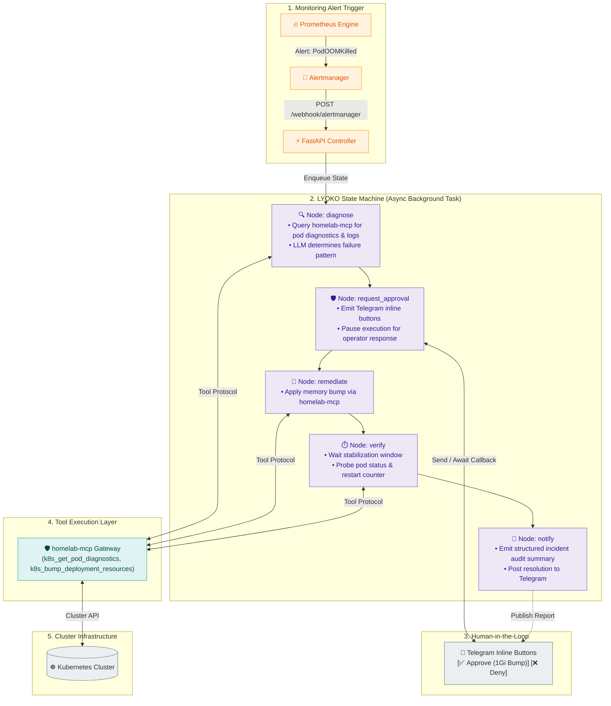

# LYOKO

[](https://github.com/langchain-ai/langgraph)
[](https://fastapi.tiangolo.com)
[](https://www.python.org/downloads/)
[](https://langfuse.com)
[](https://opensource.org/licenses/MIT)

**LYOKO** (**L**ive **Y**aml **O**ptimization & **K**8s **O**rchestration) is an event-driven autonomous incident remediation and operations agent built with **LangGraph**, **FastAPI**, and **python-telegram-bot**.

It serves two primary roles:
1. **Autonomous Incident Remediation**: Intercepts Kubernetes failure alerts from Prometheus Alertmanager, diagnoses root causes via `homelab-mcp`, pauses for Human-in-the-Loop (HITL) approval via Telegram inline buttons, applies safe live adjustments, and verifies recovery.
2. **Interactive Homelab Chat Assistant**: Provides a conversational Telegram interface powered by FastMCP tools to answer infrastructure queries, manage smart home entities (Home Assistant), inspect network topology (UniFi), and execute administrative operations.

---

## 🤖 Remediation State Machine (HITL)

LYOKO's cognitive auto-remediation loop is implemented as a deterministic **LangGraph StateGraph** finite state machine with PostgreSQL checkpoint persistence:

```mermaid
stateDiagram-v2
    direction TB
    [*] --> START
    START --> Diagnose : Prometheus Alert Ingested
    
    state Diagnose {
        [*] --> FetchDiagnostics : call_tool(k8s_get_pod_diagnostics)
        FetchDiagnostics --> LLMAnalysis : Inspect Logs & Exit Codes (OOM 137)
        LLMAnalysis --> [*] : Identify Root Cause
    }

    Diagnose --> RequestApproval : Root Cause Identified

    state RequestApproval {
        [*] --> CheckPolicy : Is OOM or Dangerous Mutation?
        CheckPolicy --> AutoProceed : Unattended Mode / Safe Action
        CheckPolicy --> PromptOperator : Send Telegram Inline Buttons
        PromptOperator --> AwaitResponse : Async Poll / Callback (Timeout 10m)
        AwaitResponse --> Approved : User Clicks Approve
        AwaitResponse --> Denied : User Clicks Reject / Timeout
        Approved --> [*] : Approval Granted
        Denied --> [*] : Requires Escalation
    }

    RequestApproval --> Remediate : Approval Granted
    RequestApproval --> Notify : Rejected / Escalation Needed

    state Remediate {
        [*] --> CheckSafetyGuard
        CheckSafetyGuard --> PatchDeployment : call_tool(k8s_bump_deployment_resources)
        PatchDeployment --> [*] : Apply Resource Increase
    }

    Remediate --> Verify : Action Executed

    state Verify {
        [*] --> StabilizationWait : Sleep (Verification Delay)
        StabilizationWait --> ProbePod : Query Current Pod Phase
        ProbePod --> [*] : Confirm Running / Healthy
    }

    Verify --> Notify : Verification Complete

    state Notify {
        [*] --> FormatReport
        FormatReport --> TelegramAlert : Structured Incident HTML Report
        TelegramAlert --> [*] : Completed
    }

    Notify --> END
    END --> [*]
```



---

## ⚡ Incident Remediation Workflow



---

## 💬 Interactive Telegram Chat Assistant

LYOKO connects directly to Telegram as a bidirectional operations assistant:
- **RBAC Authorization**: Restricts access via `TELEGRAM_ALLOWED_USER_IDS` and `TELEGRAM_ALLOWED_CHAT_IDS`.
- **Targeted Tool Discovery**: Queries tools on demand using `gateway_list_tools(query="...")` and `gateway_get_tool_schema` to maintain lean context windows (<2,000 tokens per turn).
- **Clean HTML Formatting**: Automatically converts LLM Markdown into Telegram-compliant HTML tags without mangling underscore identifiers (`MOVISTAR_25EO_IOT`).

---

## 🔭 Observability & Tracing (Langfuse)

All LLM runs, ReAct agent turns, and StateGraph checkpoints are natively traced in **Langfuse**:
- **Sessions**: Threaded per Telegram chat (`telegram-{chat_id}`) and incident ID (`inc-{id}`).
- **Environments**: Explicitly segregated (`ENVIRONMENT=local` vs `ENVIRONMENT=homelab`).
- **Cost & Token Tracking**: Real-time token usage and cost accounting across all generations.

---

## ⚙️ Configuration Reference

Configure LYOKO using environment variables (in `.env` or Kubernetes ConfigMap/Secret):

| Variable | Default | Description |
| :--- | :--- | :--- |
| `ENVIRONMENT` | `local` | Operational environment tag (`local`, `homelab`, `production`). |
| `LYOKO_HOST` | `0.0.0.0` | Webhook receiver bind host. |
| `LYOKO_PORT` | `9000` | Webhook receiver bind port. |
| `OPENAI_API_KEY` | `""` | OpenAI API key for LLM diagnosis and chat. |
| `OPENAI_MODEL` | `gpt-4o-mini` | LLM model used for chat and remediation reasoning. |
| `MCP_SERVER_URL` | `http://localhost:8000/mcp` | URL of the `homelab-mcp` gateway endpoint. |
| `SERVICE_TOKEN` | `""` | Bearer token for authenticating against `homelab-mcp`. |
| `TELEGRAM_ENABLED` | `false` | Enable Telegram assistant, channel posting, and HITL approvals. |
| `TELEGRAM_BOT_TOKEN` | `""` | Telegram Bot Token from `@BotFather`. |
| `TELEGRAM_ALLOWED_USER_IDS` | `[]` | List of authorized Telegram user IDs. |
| `TELEGRAM_ALLOWED_CHAT_IDS` | `[]` | List of authorized Telegram channel/group IDs. |
| `TELEGRAM_DEFAULT_CHAT_ID` | `""` | Default chat ID for broadcast notifications and alerts. |
| `LANGFUSE_ENABLED` | `false` | Enable Langfuse tracing and observability. |
| `LANGFUSE_PUBLIC_KEY` | `""` | Langfuse Project Public API Key. |
| `LANGFUSE_SECRET_KEY` | `""` | Langfuse Project Secret API Key. |
| `LANGFUSE_HOST` | `https://cloud.langfuse.com` | Langfuse instance host URL. |
| `POSTGRES_CHECKPOINTER_URL` | `""` | PostgreSQL connection string for LangGraph persistent state checkpointing. |

---

## 🔔 Prometheus Alertmanager Integration

Configure your Prometheus Alertmanager `config.yml` to route firing pod alerts directly to LYOKO:

```yaml
receivers:
  - name: "lyoko-remediation"
    webhook_configs:
      - url: "http://lyoko.aiops.svc.cluster.local:9000/webhook/alertmanager"
        send_resolved: false

route:
  group_by: ["alertname", "namespace", "pod"]
  group_wait: 10s
  group_interval: 30s
  repeat_interval: 1h
  routes:
    - match:
        alertname: KubePodCrashLooping
      receiver: "lyoko-remediation"
    - match:
        alertname: KubePodOOMKilled
      receiver: "lyoko-remediation"
```

---

## 🚀 Running LYOKO Locally

```bash
# Start LYOKO agent (FastAPI server on port 9000)
uv run --package lyoko python -m lyoko.main
```

---

## 🧪 Testing

```bash
# Run LYOKO workflow, webhook, and connector test suites
uv run pytest tests/agents/lyoko/
```
