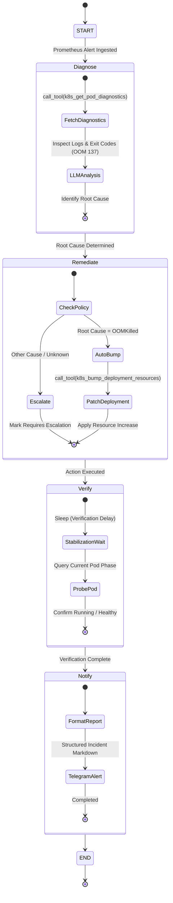
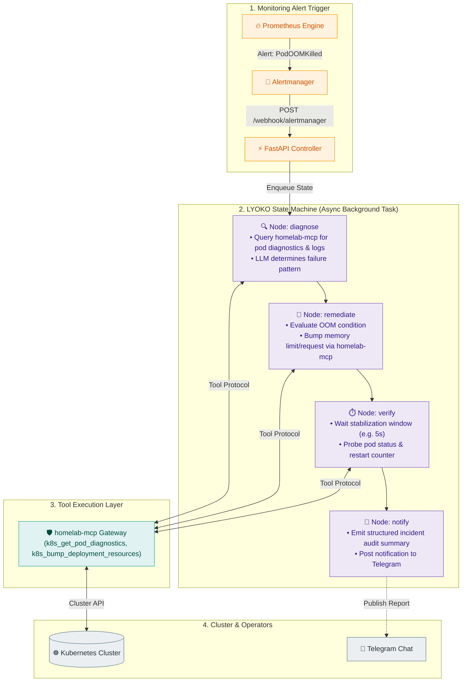

# LYOKO

[](https://github.com/langchain-ai/langgraph)
[](https://fastapi.tiangolo.com)
[](https://www.python.org/downloads/)
[](https://opensource.org/licenses/MIT)

**LYOKO** (**L**ive **Y**aml **O**ptimization & **K**8s **O**rchestration) is an event-driven autonomous incident remediation agent built with **LangGraph** and **FastAPI**. It intercepts Kubernetes failure alerts from Prometheus Alertmanager, performs root-cause analysis via the `homelab-mcp` tool gateway, applies safe live adjustments, and verifies service recovery.

---

## 🤖 Remediation State Machine

LYOKO's cognitive loop is implemented as a deterministic **LangGraph StateGraph** finite state machine:



---

## ⚡ Incident Remediation Workflow



---

## ⚙️ Configuration Reference

Configure LYOKO using environment variables (in `.env` or Kubernetes ConfigMap/Secret):

| Variable | Default | Description |
| :--- | :--- | :--- |
| `LYOKO_HOST` | `0.0.0.0` | Webhook receiver interface. |
| `LYOKO_PORT` | `9000` | Webhook receiver port. |
| `MCP_SERVER_URL` | `http://localhost:8000/mcp` | URL of the `homelab-mcp` gateway endpoint. |
| `OPENAI_API_KEY` | `""` | OpenAI API key for LLM diagnosis. |
| `OPENAI_MODEL` | `gpt-4o-mini` | LLM model used for root-cause inference. |
| `VERIFICATION_DELAY_SECONDS` | `5` | Stabilization wait time (in seconds) before post-remediation verification. |
| `TELEGRAM_BOT_TOKEN` | `""` | Telegram bot token for alerting. |
| `TELEGRAM_CHAT_ID` | `""` | Telegram chat ID for incident reports. |

---

## 🔔 Prometheus Alertmanager Integration

Configure your Prometheus Alertmanager `config.yml` to route firing pod alerts directly to LYOKO:

```yaml
receivers:
  - name: "lyoko-remediation"
    webhook_configs:
      - url: "http://lyoko.aiops.svc.cluster.local:9000/webhook/alertmanager"
        send_resolved: false

route:
  group_by: ["alertname", "namespace", "pod"]
  group_wait: 10s
  group_interval: 30s
  repeat_interval: 1h
  routes:
    - match:
        alertname: KubePodCrashLooping
      receiver: "lyoko-remediation"
    - match:
        alertname: KubePodOOMKilled
      receiver: "lyoko-remediation"
```

---

## 🚀 Running LYOKO Locally

```bash
# Start LYOKO agent (FastAPI server on port 9000)
uv run --package lyoko python -m lyoko.main
```

### Triggering a Test Webhook

Simulate a firing Alertmanager event:

```bash
curl -X POST http://localhost:9000/webhook/alertmanager \
  -H "Content-Type: application/json" \
  -d '{
    "alerts": [
      {
        "status": "firing",
        "labels": {
          "alertname": "KubePodOOMKilled",
          "namespace": "default",
          "pod": "web-service-6789abcd-ef123",
          "deployment": "web-service"
        },
        "annotations": {
          "summary": "Pod terminated with OOMKilled exit code 137"
        }
      }
    ]
  }'
```

---

## 🧪 Testing

```bash
# Run LYOKO workflow and webhook test suites
uv run pytest tests/agents/lyoko/
```
