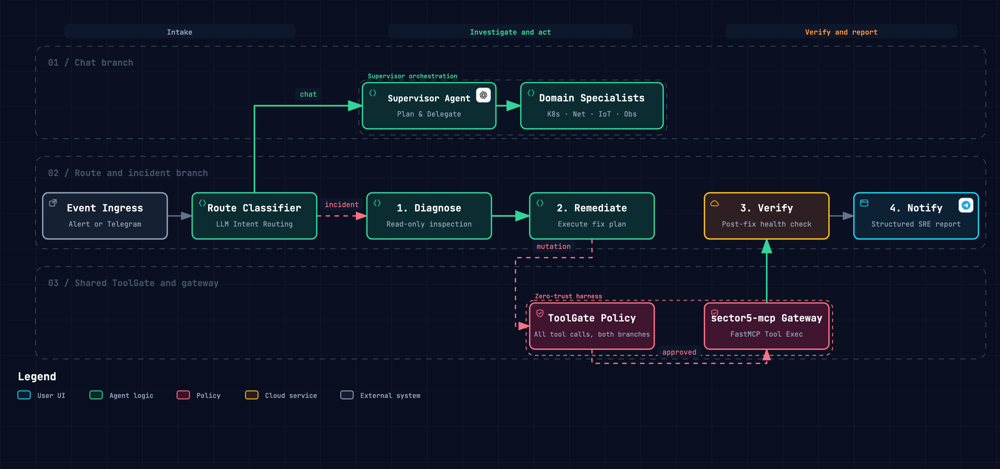

# LYOKO

[](https://github.com/langchain-ai/langgraph)
[](https://fastapi.tiangolo.com)
[](https://www.python.org/downloads/)
[](https://langfuse.com)
[](https://opensource.org/licenses/MIT)

**LYOKO** (**L**ive **Y**aml **O**ptimization & **K**8s **O**rchestration) is an event-driven AI operator for the homelab, built with **LangGraph**, **FastAPI**, and **python-telegram-bot**. It acts through the `homelab-mcp` gateway, so it can work on anything the gateway exposes: Kubernetes, UniFi, Home Assistant, Grafana, and GitHub.

It serves two roles:
1. **Autonomous incident remediation**: receives an alert (Prometheus Alertmanager webhook), diagnoses the root cause, proposes a fix, asks a human for approval unless the action is trusted, applies it, and verifies recovery.
2. **Interactive chat assistant**: a Telegram interface through the same supervisor and specialists, to answer questions about the infrastructure and operate it, for example scale a workload, inspect a UniFi device, or change a Home Assistant entity.

Both roles are one **LangGraph StateGraph**. They share the same supervisor, domain specialists, ToolGate approval policy, and Langfuse traces.

## How it works
 
Every event enters the graph at `route` and takes one of two branches:
- **Interactive Chat**: The **Supervisor Agent** coordinates cross-domain requests and multi-step plans by delegating to specialized domain subagents (**K8s SRE**, **Network Specialist**, **Smart Home Specialist**, **Observability Specialist**).
- **Incident Remediation**: Autonomous 4-stage SRE workflow (`diagnose` ➔ `remediate` ➔ `verify` ➔ `notify`). Each of the first three stages is a supervisor run that delegates to the same domain specialists.


<p align="center">
  
</p>

| Node / Component | What it does |
| :--- | :--- |
| `route` | Alerts always take the incident branch. For a Telegram message, an LLM classifier decides between `chat` (interactive queries/instructions) and the incident branch (reports of broken infrastructure). |
| `Supervisor` | Coordinates cross-domain operations and plans multi-step actions by calling `ask_<domain>_specialist` tools. Used by chat and by each incident stage. |
| `Domain Specialists` | Focused experts with scoped toolsets: `K8sSpecialist` (pods, logs, resources, Argo CD CRDs), `NetworkSpecialist` (clients, bandwidth, APs, VLANs), `SmartHomeSpecialist` (entities, devices, automations), `ObservabilitySpecialist` (Prometheus metrics, alerts). Small domains bind every domain tool; large domains keep domain-locked discovery. |
| `diagnose` | Supervisor-led, read-only investigation across specialists. Returns root cause, whether it is auto-fixable, and a remediation plan. |
| `remediate` | Supervisor-led execution of the plan. State-changing specialist tool calls are gated by the `ToolGate` and need operator approval via Telegram inline buttons. |
| `verify` | Supervisor-led, read-only check after a stabilization window that the issue has cleared. |
| `notify` | Builds a structured incident report (`RESOLVED` or `ESCALATED`) with approved/denied actions and recovery verification. |


### Tool gate

Safety does not depend on the model behaving. Every upstream tool call a specialist makes goes through a gate that applies the same policy to any tool, whatever system it belongs to and whichever branch made the call:

1. **Read-only tools** (`READ_ONLY_TOOLS`) always run. The default patterns cover inspection tools such as `k8s_pods_get`, `k8s_pods_log`, `k8s_events_list`, and `ha_get_*`.
2. **Auto-approved tools** (`AUTO_APPROVED_TOOLS`) run without asking and are recorded. The default is empty.
3. **Everything else needs approval.** LYOKO sends Telegram buttons that show the exact tool and arguments, and waits up to five minutes for the operator. A timeout counts as a denial. During diagnosis and verification the call is refused instead, because those phases are read-only.

If no approval channel is configured, changes are refused. They are never approved by default. The incident report is built from what the gate actually allowed, not from the model's own account of what it did. The gateway's own guardrails still apply to every call.

> [!NOTE]
> Tool names are matched with glob patterns, and a name that matches neither list is treated as state-changing. For example, `unifi_execute` is a generic executor, so each call asks for approval even when it only reads.

## Telegram chat assistant

LYOKO connects directly to Telegram as a bidirectional operations assistant:
- **RBAC Authorization**: Restricts access via `TELEGRAM_ALLOWED_USER_IDS` and `TELEGRAM_ALLOWED_CHAT_IDS`.
- **Supervisor delegation**: The chat supervisor delegates to domain specialists (`ask_kubernetes_specialist`, `ask_unifi_specialist`, ...). Specialists receive a scoped domain toolset (or domain-locked discovery for large catalogs) instead of searching the whole gateway.
- **Approvals in chat**: a change you ask for shows the same Approve / Deny buttons as an alert. Messages are handled concurrently, so a request waiting for your answer does not block other messages or the button click itself.
- **Clean HTML Formatting**: Automatically converts LLM Markdown into Telegram-compliant HTML tags without mangling underscore identifiers (`MOVISTAR_25EO_IOT`).

## Observability

Each event produces **one Langfuse trace**, and everything it does is a named span inside it:

```text
telegram-chat-interaction / lyoko-<alert>-<id>   one trace per event
├── route
│   └── route-llm                                routing decision (messages only)
└── chat | diagnose | remediate | verify
    └── supervisor-coordination                  supervisor ReAct run
        ├── ask_kubernetes_specialist            (or unifi / homeassistant / grafana)
        │   └── specialist-kubernetes            specialist ReAct run
        │       └── mcp:k8s_pods_log             bound domain tool (or gateway_call_tool)
        └── ...
```

- **Sessions**: Threaded per Telegram chat session (`telegram-{chat_id}-{date}-{time}`, reset with `/new`) and per incident (`incident-{id}`). Replying to an alert message continues that incident's session.
- **Environments**: Explicitly segregated (`ENVIRONMENT=local` vs `ENVIRONMENT=homelab`).
- **Cost & Token Tracking**: Real-time token usage and cost accounting across all generations.

## Configuration

Configure LYOKO using environment variables (in `.env` or Kubernetes ConfigMap/Secret):

| Variable | Default | Description |
| :--- | :--- | :--- |
| `ENVIRONMENT` | `local` | Operational environment tag (`local`, `homelab`, `production`). |
| `LYOKO_HOST` | `0.0.0.0` | Webhook receiver bind host. |
| `LYOKO_PORT` | `9000` | Webhook receiver bind port. |
| `OPENAI_API_KEY` | `""` | OpenAI API key for LLM diagnosis, chat, and embeddings. |
| `OPENAI_MODEL` | `gpt-4o-mini` | LLM model used for chat and remediation reasoning. |
| `MCP_SERVER_URL` | `http://localhost:8000/mcp` | URL of the `homelab-mcp` gateway endpoint. |
| `SERVICE_TOKEN` | `""` | Bearer token for authenticating against `homelab-mcp`. Required when the gateway runs with `AUTH_ENABLED=true`. |
| `MCP_FAIL_FAST` | `true` | Abort startup if the gateway rejects credentials (401/403) or the URL is not an MCP endpoint (404). |
| `READ_ONLY_TOOLS` | inspection patterns (`get_*`, `*_list`, `*_log`, ...) | Glob patterns of tools the incident agent may call freely. Comma-separated or JSON list. |
| `AUTO_APPROVED_TOOLS` | `[]` | Glob patterns of state-changing tools that run during remediation without approval (e.g. `k8s_resources_scale`). |
| `MAX_AGENT_STEPS` | `25` | Maximum tool-use iterations of each specialist run. |
| `MAX_SUPERVISOR_STEPS` | `5` | Maximum supervisor delegation iterations per phase. |
| `TELEGRAM_ENABLED` | `false` | Enable Telegram assistant, channel posting, and HITL approvals. |
| `TELEGRAM_BOT_TOKEN` | `""` | Telegram Bot Token from `@BotFather`. |
| `TELEGRAM_ALLOWED_USER_IDS` | `[]` | List of authorized Telegram user IDs. |
| `TELEGRAM_ALLOWED_CHAT_IDS` | `[]` | List of authorized Telegram channel/group IDs. |
| `TELEGRAM_DEFAULT_CHAT_ID` | `""` | Default chat ID for broadcast notifications and alerts. |
| `LANGFUSE_ENABLED` | `true` | Enable Langfuse tracing and observability. |
| `LANGFUSE_PUBLIC_KEY` | `""` | Langfuse Project Public API Key. |
| `LANGFUSE_SECRET_KEY` | `""` | Langfuse Project Secret API Key. |
| `LANGFUSE_HOST` | `https://cloud.langfuse.com` | Langfuse instance host URL. |
| `CHAT_SESSION_IDLE_TIMEOUT_SECONDS` | `900` | Idle seconds before chat session resets to a new trace context. |
| `POSTGRES_HOST` | `postgresql-rw...` | PostgreSQL hostname for persistent state and episodic vector memory (`pgvector`). |
| `POSTGRES_PORT` | `5432` | PostgreSQL database port. |
| `POSTGRES_DB` | `lyoko` | PostgreSQL database name. |
| `POSTGRES_USER` | `lyoko` | PostgreSQL database username. |
| `POSTGRES_PASSWORD` | `""` | PostgreSQL database password. |
| `POSTGRES_URI` | `""` | Optional full PostgreSQL connection URI override. |

## Alertmanager integration

Configure your Prometheus Alertmanager `config.yml` to route the alerts you want LYOKO to handle. Any alert works, because LYOKO receives all of its labels and annotations. The routes below are examples:

```yaml
receivers:
  - name: "lyoko-remediation"
    webhook_configs:
      - url: "http://lyoko.aiops.svc.cluster.local:9000/webhook/alertmanager"
        send_resolved: false

route:
  group_by: ["alertname"]
  group_wait: 10s
  group_interval: 30s
  repeat_interval: 1h
  routes:
    - match:
        alertname: KubePodCrashLooping
      receiver: "lyoko-remediation"
    - match:
        alertname: KubePodOOMKilled
      receiver: "lyoko-remediation"
    - match_re:
        alertname: "Unifi.*Offline"
      receiver: "lyoko-remediation"
```

## Running locally

```bash
# Start LYOKO agent (FastAPI server on port 9000)
uv run --package lyoko python -m lyoko.main
```

## Testing

```bash
# Run LYOKO workflow, webhook, and connector test suites
uv run pytest tests/agents/lyoko/
```
