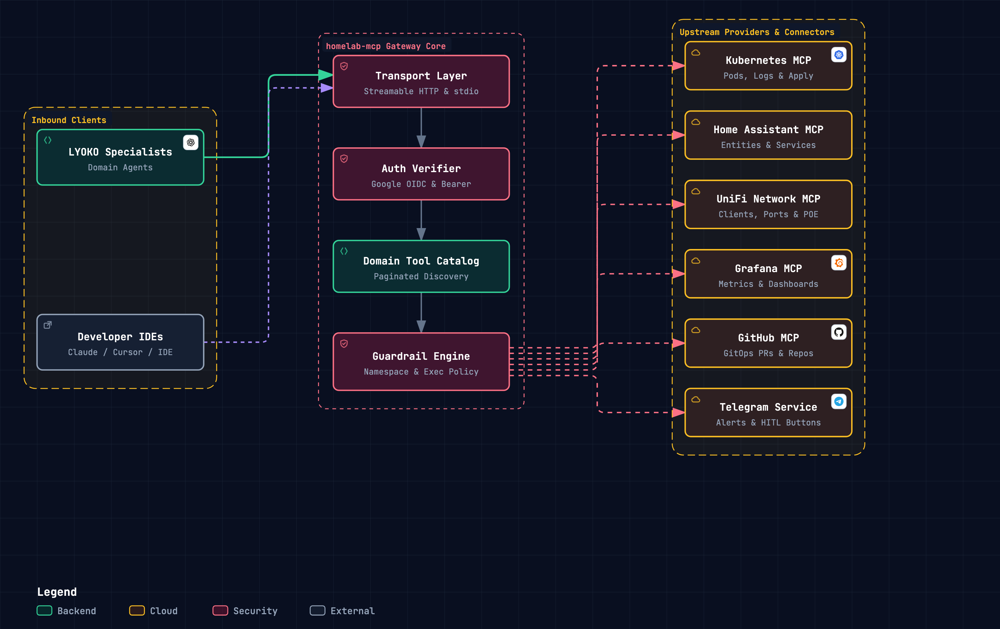

# homelab-mcp

[](https://github.com/jlowin/fastmcp)
[](https://www.python.org/downloads/)
[](https://opensource.org/licenses/MIT)

**`homelab-mcp`** is a unified **Model Context Protocol (MCP)** tool gateway and security harness. It aggregates upstream MCP servers for Kubernetes, Home Assistant, UniFi Network, Grafana, and GitHub, plus a built-in Telegram domain, into a single, authenticated, guardrail-protected endpoint accessible over **Streamable HTTP** (`/mcp`) and **stdio**.

## Architecture

<p align="center">
  
</p>

`homelab-mcp` exposes a small, uniform tool surface so an agent never has to load the whole catalog into context:
- **Domain Discovery**: `gateway_get_domain_tools(domain, limit=50, offset=0)` returns a lean index (name + one-line description) of the domain's tools, paginated (`limit` max 100, follow `has_more`) so large domains like UniFi (200+ tools) never flood the context. Domain aliases resolve automatically (`network` ➔ `unifi`, `k8s` / `gitops` / `argocd` ➔ `kubernetes`, `iot` ➔ `homeassistant`, `metrics` / `prometheus` ➔ `grafana`).
- **On-Demand Schema**: `gateway_get_tool_schema(tool_name)` returns the full parameter schema of a single tool, fetched only right before it is called.
- **Single Execution Choke Point**: `gateway_call_tool(tool_name, arguments)` runs any upstream tool, but only after the guardrail engine approves it.
- **Domains**: `kubernetes`, `unifi`, `homeassistant`, `grafana`, `github`, and `telegram` (provided in-process by the gateway).


## Guardrails

Every tool call is evaluated by the `GuardrailEngine` before it is dispatched upstream. The first failing check rejects the call.

<p align="center">
  
</p>

### Security capabilities
1. **Namespace Isolation**: Protected namespaces like `kube-system` are read-only. Only Kubernetes tools that match a read-only pattern (`*_get`, `*_list`, `*_log`, `*_top`, and similar) may target them, so every other tool, including new or unknown ones, is rejected. The target namespace is read from the `namespace` argument, from the `metadata.namespace` of a `resource` manifest, and from the name of a `Namespace` object. A manifest that cannot be parsed is rejected. Calls that name no namespace use the namespace from your kubeconfig.
2. **Command Exec Filtering**: Commands executed in containers or hosts are parsed via `shlex` and evaluated against regex signatures for destructive operations (`rm -rf /`, `dd if=...`, `mkfs`, fork bombs).
3. **Multi-Tenant Google OIDC Authentication**: Support for Google OAuth / OIDC with email allowlisting to restrict gateway tool execution to verified identities.

## Tool domains

Tool names come straight from each upstream server. Call `gateway_get_domain_tools(domain="kubernetes")` to list a domain's tools (lean index), then `gateway_get_tool_schema(tool_name=...)` and `gateway_call_tool(tool_name=..., arguments={...})` to inspect and run one.

| Domain | Upstream MCP provider | Capabilities | Example tools |
| :--- | :--- | :--- | :--- |
| **Kubernetes** | [`kubernetes-mcp-server`](https://github.com/containers/kubernetes-mcp-server) | Pod and resource inspection, logs, events, node and pod metrics, scaling, applying manifests, exec. Argo CD Applications are inspected as CRDs. | `k8s_pods_get`<br/>`k8s_pods_log`<br/>`k8s_resources_scale`<br/>`k8s_resources_create_or_update` |
| **Home Assistant** | [`homeassistant-ai/ha-mcp`](https://github.com/homeassistant-ai/ha-mcp) | Entity state inspection, service calls, automations, areas, helpers, add-ons, configuration. | `ha_get_state`<br/>`ha_call_service`<br/>`ha_set_entity` |
| **UniFi Network** | [`sirkirby/unifi-mcp`](https://github.com/sirkirby/unifi-mcp) | Network topology, clients, devices, switches, APs, firewall, VPN, routing, statistics, support bundles. | `unifi_tool_index`<br/>`unifi_execute`<br/>`unifi_get_support_bundle` |
| **Grafana** | [`grafana/mcp-grafana`](https://github.com/grafana/mcp-grafana) | Dashboards, datasources, and queries against your Grafana instance. | Discover with `gateway_get_domain_tools` |
| **GitHub** | [`github/github-mcp-server`](https://github.com/github/github-mcp-server) | Repository inspection and GitOps pull requests, restricted by an allowlist and denylist of repositories. | Discover with `gateway_get_domain_tools` |
| **Telegram** | Built into the gateway | Send messages and alerts, and set message reactions. | `telegram_send_message`<br/>`telegram_send_alert`<br/>`telegram_set_reaction` |

## Configuration

Configure `homelab-mcp` via environment variables (in `.env` or container environments):

| Variable | Default | Description |
| :--- | :--- | :--- |
| `MCP_HOST` | `0.0.0.0` | Gateway listening interface. |
| `MCP_PORT` | `8000` | Gateway listening HTTP port. |
| `MCP_TRANSPORT` | `http` | Transport mode: `http` (Streamable HTTP on `/mcp`) or `stdio`. |
| `AUTH_ENABLED` | `false` | Enable/disable token and Google OIDC verification. |
| `GOOGLE_CLIENT_ID` | `""` | Google OAuth client ID for OIDC proxy. |
| `GOOGLE_CLIENT_SECRET` | `""` | Google OAuth client secret for OIDC proxy. |
| `ALLOWED_GOOGLE_EMAILS` | `[]` | Allowed Google email addresses. |
| `SERVICE_TOKEN` | `""` | Bearer token for authenticating in-cluster agents. |
| `JWT_SECRET` | `""` | Secret key for signing/verifying HS256 JWT tokens. |
| `HA_ENABLED` | `true` | Enable Home Assistant upstream MCP. |
| `HASS_URL` | `http://homeassistant...:8123` | Home Assistant instance URL. |
| `HASS_TOKEN` | `""` | Long-lived access token for Home Assistant. |
| `UNIFI_ENABLED` | `true` | Enable UniFi Network upstream MCP. |
| `UNIFI_URL` | `https://192.168.1.1` | UniFi controller URL / gateway IP. |
| `UNIFI_USER` | `""` | UniFi admin username. |
| `UNIFI_PASSWORD` | `""` | UniFi admin password. |
| `UNIFI_SITE` | `default` | UniFi site identifier. |
| `K8S_ENABLED` | `true` | Enable Kubernetes upstream MCP. |
| `KUBECONFIG_PATH` | `""` | Path to kubeconfig (or in-cluster ServiceAccount if unset). |
| `GRAFANA_ENABLED` | `true` | Enable Grafana upstream MCP. |
| `GRAFANA_URL` | `http://grafana...:3000` | Grafana base URL. |
| `GRAFANA_TOKEN` | `""` | Grafana service account or API token. |
| `GRAFANA_COMMAND` | `npx -y @grafana/mcp-server@latest` | Command used to launch the Grafana MCP server. |
| `GITHUB_ENABLED` | `true` | Enable GitHub upstream MCP. |
| `GITHUB_COMMAND` | `npx -y @modelcontextprotocol/server-github` | Command used to launch the GitHub MCP server. |
| `GITHUB_TOKEN` | `""` | GitHub personal access token. |
| `GITHUB_OWNER` | `""` | Default GitHub owner or organization. |
| `GITHUB_ALLOWED_REPOS` | `["*"]` | Glob patterns of repositories tools may target. |
| `GITHUB_BLOCKED_REPOS` | `[]` | Glob patterns of repositories that are always blocked. |
| `TELEGRAM_ENABLED` | `false` | Enable the built-in Telegram tools. |
| `TELEGRAM_BOT_TOKEN` | `""` | Telegram bot token from `@BotFather`. |
| `TELEGRAM_DEFAULT_CHAT_ID` | `""` | Default chat for alerts and messages. |
| `ALLOWED_TOOLS` | `["*"]` | Glob patterns of permitted tool names. |
| `BLOCKED_TOOLS` | `[]` | Glob patterns of strictly forbidden tool names. |
| `BLOCKED_NAMESPACES` | `["kube-system", ...]` | Namespaces where mutations and exec are prohibited. |
| `BLOCKED_EXEC_PATTERNS` | `[rm, dd, mkfs, ...]` | Regex patterns prohibited in container exec arguments. |

## Usage

### 1. Running as Streamable HTTP Server (Cluster / Monorepo Mode)

```bash
uv run --package homelab-mcp python -m homelab_mcp.server
```

The gateway exposes its endpoints:
- Tool Gateway: `http://localhost:8000/mcp`
- Tool Discovery: Dynamic aggregation with 300s TTL cache.

### 2. Claude Desktop / Cursor IDE Integration (`stdio` Mode)

Add the following to your `claude_desktop_config.json` or Cursor MCP settings:

```json
{
  "mcpServers": {
    "homelab": {
      "command": "uv",
      "args": [
        "--directory",
        "/path/to/lyoko-ai-ops",
        "run",
        "--package",
        "homelab-mcp",
        "python",
        "-m",
        "homelab_mcp.server"
      ],
      "env": {
        "MCP_TRANSPORT": "stdio",
        "HASS_URL": "http://homeassistant.local:8123",
        "HASS_TOKEN": "your-token-here",
        "UNIFI_HOST": "https://192.168.1.1",
        "UNIFI_USER": "admin",
        "UNIFI_PASSWORD": "your-password"
      }
    }
  }
}
```

## Testing

```bash
# Run unit and integration tests for homelab-mcp
uv run pytest tests/mcps/homelab_mcp/
```
