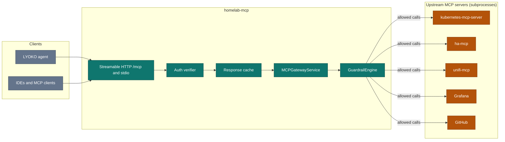
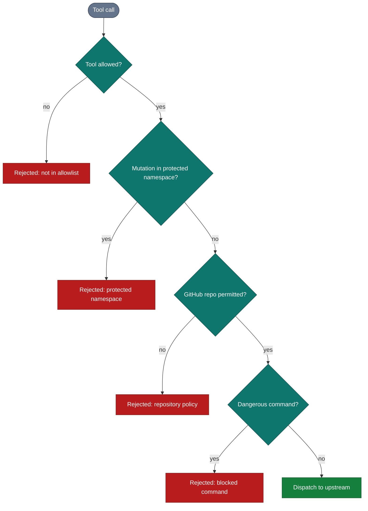

# homelab-mcp

[](https://github.com/jlowin/fastmcp)
[](https://www.python.org/downloads/)
[](https://opensource.org/licenses/MIT)

**`homelab-mcp`** is a unified **Model Context Protocol (MCP)** tool gateway and security harness. It aggregates upstream MCP servers for Kubernetes, Home Assistant, UniFi Network, Grafana, and GitHub into a single, authenticated, guardrail-protected endpoint accessible over **Streamable HTTP** (`/mcp`) and **stdio**.

## Architecture



The response cache applies to `list_tools` (300s TTL). Each upstream can be switched off with its `*_ENABLED` variable.

## Guardrails

Every tool call is evaluated by the `GuardrailEngine` before it is dispatched upstream. The first failing check rejects the call.



### Security capabilities
1. **Namespace Isolation**: Mutating actions (`delete`, `patch`, `update`, `restart`, `bump`, `exec`) targeting protected namespaces like `kube-system` are intercepted and rejected.
2. **Command Exec Filtering**: Commands executed in containers or hosts are parsed via `shlex` and evaluated against regex signatures for destructive operations (`rm -rf /`, `dd if=...`, `mkfs`, fork bombs).
3. **Multi-Tenant Google OIDC Authentication**: Support for Google OAuth / OIDC with email allowlisting to restrict gateway tool execution to verified identities.

## Tool domains

| Domain | Upstream MCP Provider | Capabilities | Example Tools |
| :--- | :--- | :--- | :--- |
| **Kubernetes** | `kubernetes-mcp-server` | Pod diagnostics, logs, deployment resource adjustments, rollout restarts, namespace queries. | `k8s_get_pod_diagnostics`<br/>`k8s_bump_deployment_resources`<br/>`k8s_rollout_restart` |
| **Home Assistant** | `homeassistant-ai/ha-mcp` | IoT entity state inspection, domain service execution, automation trigger, health monitoring. | `ha_get_state`<br/>`ha_call_service`<br/>`ha_get_overview` |
| **UniFi Network** | `sirkirby/unifi-mcp` | Network topology, connected client inspection, port profiles, controller metrics, support bundles. | `unifi_tool_index`<br/>`unifi_execute`<br/>`unifi_get_support_bundle` |

## Configuration

Configure `homelab-mcp` via environment variables (in `.env` or container environments):

| Variable | Default | Description |
| :--- | :--- | :--- |
| `MCP_HOST` | `0.0.0.0` | Gateway listening interface. |
| `MCP_PORT` | `8000` | Gateway listening HTTP port. |
| `MCP_TRANSPORT` | `http` | Transport mode: `http` (Streamable HTTP) or `stdio`. |
| `AUTH_ENABLED` | `false` | Enable/disable token and OIDC verification. |
| `GOOGLE_CLIENT_ID` | `""` | Google OAuth client ID for OIDC proxy. |
| `GOOGLE_CLIENT_SECRET`| `""` | Google OAuth client secret for OIDC proxy. |
| `HASS_ENABLED` | `true` | Enable Home Assistant upstream MCP. |
| `HASS_URL` | `http://homeassistant...:8123` | Home Assistant instance URL. |
| `HASS_TOKEN` | `""` | Long-lived access token for Home Assistant. |
| `UNIFI_ENABLED` | `true` | Enable UniFi Network upstream MCP. |
| `UNIFI_URL` | `https://192.168.1.1` | UniFi controller URL / gateway IP. |
| `UNIFI_USER` | `""` | UniFi admin username. |
| `UNIFI_PASSWORD` | `""` | UniFi admin password. |
| `K8S_ENABLED` | `true` | Enable Kubernetes upstream MCP. |
| `KUBECONFIG` | `~/.kube/config` | Path to kubeconfig (or in-cluster SA). |

## Usage

### 1. Running as Streamable HTTP Server (Cluster / Monorepo Mode)

```bash
uv run --package homelab-mcp python -m homelab_mcp.server
```

The gateway exposes its endpoints:
- Tool Gateway: `http://localhost:8000/mcp`
- Tool Discovery: Dynamic aggregation with 300s TTL cache.

### 2. Claude Desktop / Cursor IDE Integration (`stdio` Mode)

Add the following to your `claude_desktop_config.json` or Cursor MCP settings:

```json
{
  "mcpServers": {
    "homelab": {
      "command": "uv",
      "args": [
        "--directory",
        "/path/to/homelab-aiops",
        "run",
        "--package",
        "homelab-mcp",
        "python",
        "-m",
        "homelab_mcp.server"
      ],
      "env": {
        "MCP_TRANSPORT": "stdio",
        "HASS_URL": "http://homeassistant.local:8123",
        "HASS_TOKEN": "your-token-here",
        "UNIFI_HOST": "https://192.168.1.1",
        "UNIFI_USER": "admin",
        "UNIFI_PASSWORD": "your-password"
      }
    }
  }
}
```

## Testing

```bash
# Run unit and integration tests for homelab-mcp
uv run pytest tests/mcps/homelab_mcp/
```
